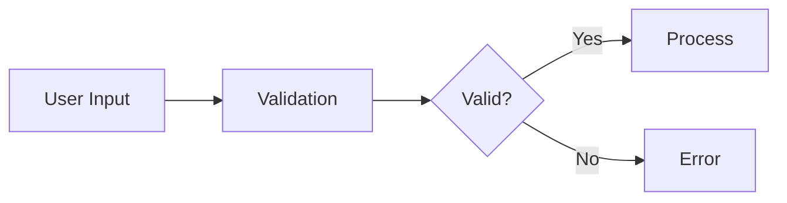

# Markdown Style Guide for CasaReady Documentation

**Version:** 1.0
**Last Updated:** 2025-10-07
**Status:** ✅ Approved

---

## 📋 Table of Contents

1. [Document Structure](#document-structure)
2. [Heading Hierarchy](#heading-hierarchy)
3. [Code Blocks](#code-blocks)
4. [Links and References](#links-and-references)
5. [Lists](#lists)
6. [Tables](#tables)
7. [Emphasis and Formatting](#emphasis-and-formatting)
8. [Images and Diagrams](#images-and-diagrams)
9. [Admonitions and Callouts](#admonitions-and-callouts)
10. [Front Matter and Metadata](#front-matter-and-metadata)
11. [Tone and Voice](#tone-and-voice)
12. [File Organization](#file-organization)
13. [Validation Checklist](#validation-checklist)

---

## 1. Document Structure

### Required Sections

Every documentation file MUST include:

```markdown
# Page Title (H1)

**Brief description** of what this document covers

---

## Table of Contents (H2)
[For documents > 200 lines]

---

## Main Content Sections (H2)

### Subsections (H3)

---

## Related Documentation (H2)
[At bottom of file]

- [Link 1](../path/to/doc1.md)
- [Link 2](../path/to/doc2.md)

---

**Metadata Footer:**
Last Updated: YYYY-MM-DD
Status: ✅ Current | ⚠️ In Progress | 🔴 Outdated
```

### Optional Sections

Include as needed:
- **Prerequisites** (for how-to guides)
- **Quick Start** (for getting started docs)
- **Examples** (code-heavy documentation)
- **Troubleshooting** (technical guides)
- **FAQ** (user-facing docs)

---

## 2. Heading Hierarchy

### Rules

1. **ONE H1 per file** - Always the page title
2. **Logical nesting** - Don't skip levels (H2 → H4 is invalid)
3. **Use sentence case** - "Creating a new feature" not "Creating A New Feature"
4. **No emojis in headings** - Use in content, not headers
5. **Descriptive, not cute** - "Installation Steps" not "Let's Get Started!"

### Examples

✅ **Good:**
```markdown
# Feature Implementation Guide

## Installation

### Prerequisites

### Install Dependencies

## Configuration

### Environment Variables
```

❌ **Bad:**
```markdown
# 🚀 Let's Build Something Cool!

## Getting Started! 😎

#### Installation  <!-- Skipped H3 -->

## Configuration  <!-- Missing H3 for sub-topics -->
```

### Heading Length

- **H1:** 3-8 words, concise page title
- **H2:** 2-6 words, section name
- **H3:** 2-5 words, subsection name
- **H4+:** Avoid if possible, reorganize content instead

---

## 3. Code Blocks

### Syntax Highlighting

**Always specify language:**

```markdown
\`\`\`typescript
interface User {
  name: string;
  email: string;
}
\`\`\`
```

**Supported languages:**
- `typescript`, `tsx`, `javascript`, `jsx`
- `bash`, `shell`, `sh`
- `json`, `yaml`, `toml`
- `sql`, `graphql`
- `markdown`, `html`, `css`
- `diff` (for showing changes)

### Inline Code

Use single backticks for:
- Function names: `searchTexasCities()`
- Variable names: `userInput`
- File paths: `src/lib/utils.ts`
- Package names: `next`, `react`
- Commands: `npm install`

**Don't use for:**
- Emphasis (use **bold** instead)
- Quotes (use "quotes")

### Code Block Titles

For clarity, add file paths as comments:

```typescript
// src/components/wizard/WizardForm.tsx
export function WizardForm() {
  return <form>...</form>;
}
```

### Diff Blocks

Show changes clearly:

```diff
  export function example() {
-   return "old value";
+   return "new value";
  }
```

### Shell Commands

Use `$` for user commands, no prompt for output:

```bash
# Good
$ npm install
$ npm run dev

# Output (no prompt):
Server running on http://localhost:3000
```

---

## 4. Links and References

### Internal Links

**Format:** Relative paths from current file

```markdown
[Feature Documentation](../features/autocomplete/implementation.md)
[Testing Guide](../../testing/strategy.md)
[Main README](../README.md)
```

**Best Practices:**
- Use relative paths, not absolute
- Link to `.md` files, not rendered URLs
- Verify links work before committing

### External Links

```markdown
[Next.js Documentation](https://nextjs.org/docs)
[GitHub Repository](https://github.com/username/casaready)
```

**Best Practices:**
- Always use HTTPS
- Use descriptive link text (not "click here")
- Include domain for clarity: "(nextjs.org)"

### Anchor Links

For same-page navigation:

```markdown
Jump to [Configuration Section](#configuration)

## Configuration
```

**Rules:**
- Lowercase, replace spaces with hyphens
- Remove punctuation: `#my-section` not `#my-section!`

### Reference-Style Links

For repeated links:

```markdown
See the [Next.js docs][nextjs] for more info.

Another reference to [Next.js][nextjs].

[nextjs]: https://nextjs.org/docs
```

---

## 5. Lists

### Unordered Lists

**Use hyphens (`-`)**, not asterisks or plus signs:

```markdown
✅ Good:
- Item 1
- Item 2
  - Nested item 2.1
  - Nested item 2.2

❌ Bad:
* Item 1
+ Item 2
```

**Spacing:**
- One blank line before/after list
- No blank lines between items (unless sublists)

### Ordered Lists

Use `1.` for all items (auto-numbering):

```markdown
1. First step
1. Second step
1. Third step
   - Sub-point A
   - Sub-point B
1. Fourth step
```

**When to use:**
- Sequential instructions
- Ranked items
- Step-by-step guides

### Task Lists

Use for checklists:

```markdown
- [ ] Incomplete task
- [x] Completed task
- [ ] Another pending task
```

### List Item Length

- **Keep items concise:** 1-2 lines max
- **If longer:** Break into paragraphs under the item

```markdown
✅ Good:
- **Short item:** Brief description here
- **Complex item:**

  Full paragraph explanation with multiple sentences.
  Can span multiple lines for clarity.

❌ Bad:
- This is a really long list item that goes on and on with lots of detail that should probably be broken up into a paragraph format but instead it's just one giant run-on sentence.
```

---

## 6. Tables

### Basic Table

```markdown
| Column 1 | Column 2 | Column 3 |
|----------|----------|----------|
| Data 1   | Data 2   | Data 3   |
| Data 4   | Data 5   | Data 6   |
```

### Alignment

```markdown
| Left-aligned | Center-aligned | Right-aligned |
|:-------------|:--------------:|--------------:|
| Text         | Text           | 123           |
| More text    | More text      | 456           |
```

### When to Use Tables

**Good for:**
- Comparing options (features, plans, etc.)
- Configuration reference (name, type, description)
- Status reports (item, status, owner)

**Bad for:**
- Long prose content (use paragraphs)
- Nested data (use lists or code blocks)
- More than 5 columns (hard to read)

### Table Formatting

- **Keep cells concise:** 1-5 words ideal
- **Use header row:** Always include headers
- **Align consistently:** Left for text, right for numbers
- **Markdown formatting in cells:** Use sparingly

```markdown
| Feature | Status | Notes |
|---------|:------:|-------|
| Autocomplete | ✅ | Fully implemented |
| Lead scoring | ⚠️ | In progress |
| Analytics | 🔴 | Not started |
```

---

## 7. Emphasis and Formatting

### Bold

Use for:
- **Key terms** on first introduction
- **Important warnings**
- **Action items**: "**Do this now**"

```markdown
The **primary goal** is user satisfaction.
**Warning:** This action is irreversible.
```

### Italic

Use for:
- *Emphasis* within a sentence
- *Book titles*, *journal names*
- *Foreign phrases*: *et cetera*

```markdown
This is *very* important.
See the *User Guide* for details.
```

### Bold + Italic

Use sparingly for:
- ***Critical*** warnings
- ***Extreme*** emphasis

### Strikethrough

Use for showing deprecated content:

```markdown
~~Old method~~ Use this new method instead.
```

### Avoiding Overuse

❌ **Bad:**
```markdown
This is **very** **important** and you **must** pay **attention**!
```

✅ **Good:**
```markdown
This is **very important** and you must pay attention.
```

---

## 8. Images and Diagrams

### Image Syntax

```markdown

```

**Best Practices:**
- Store in `public/images/` or `docs/assets/`
- Use descriptive alt text for accessibility
- Keep file names lowercase, kebab-case: `feature-diagram.png`
- Optimize images before committing (compress PNGs/JPGs)

### Captions

Add context below images:

```markdown


*Figure 1: High-level system architecture showing data flow*
```

### Diagrams

**Preferred formats:**
1. **Mermaid** (for flowcharts, diagrams in markdown)
2. **SVG** (for illustrations, vector graphics)
3. **PNG** (for screenshots, raster graphics)

**Mermaid Example:**



### Screenshots

- **When to include:** UI changes, test results, visual bugs
- **When to exclude:** Code that can be shown in text
- **Naming:** `feature-name-description.png`
- **Location:** `docs/assets/screenshots/`

---

## 9. Admonitions and Callouts

### Blockquotes

Use for callouts and important notes:

```markdown
> **Note:** This is an important callout.

> **Warning:** Destructive action ahead.

> **Tip:** Pro users can enable this feature.
```

### Status Indicators

Use emojis for visual scanning:

```markdown
✅ **Success:** Feature implemented successfully
⚠️ **Warning:** Experimental feature, use with caution
🔴 **Critical:** Security vulnerability found
🟡 **Todo:** Implementation pending
🟢 **Info:** Additional context available
📚 **Documentation:** See related guide
🎯 **Goal:** Target outcome described
```

### Admonition Blocks

For GitHub-flavored markdown:

```markdown
> **Note**
> This is a note admonition.

> **Warning**
> This is a warning admonition.
```

### When to Use

- **Notes:** Additional context, non-critical info
- **Warnings:** Potential issues, destructive actions
- **Tips:** Pro tips, shortcuts, best practices
- **Critical:** Security, data loss, breaking changes

---

## 10. Front Matter and Metadata

### Document Metadata

At the **bottom** of each file:

```markdown
---

**Last Updated:** 2025-10-07
**Author:** Technical Team
**Status:** ✅ Current
**Related:** [Feature A](../features/a.md), [Guide B](../guides/b.md)

---
```

### Status Values

- ✅ **Current** - Up-to-date, accurate
- ⚠️ **In Progress** - Being actively updated
- 🔴 **Outdated** - Needs review/update
- 🟡 **Draft** - Work in progress, not final

### Optional Metadata

```markdown
**Created:** 2025-09-15
**Version:** 2.1
**Reviewers:** @username1, @username2
**Tags:** autocomplete, census-api, typescript
```

---

## 11. Tone and Voice

### Writing Style

**Target Audience:** Developers (junior to senior)

**Tone:**
- Professional but approachable
- Clear and concise
- Helpful, not condescending
- Direct, not overly formal

✅ **Good:**
```markdown
Run `npm install` to install dependencies.
```

❌ **Bad:**
```markdown
At this point in time, you should proceed to execute the npm install
command in order to facilitate the installation of the required dependencies.
```

### Active Voice

Use active voice for clarity:

✅ **Active:** "Next.js renders pages on the server."
❌ **Passive:** "Pages are rendered on the server by Next.js."

### Second Person

Address the reader directly:

✅ **You:** "You can configure this setting..."
❌ **Third person:** "Developers can configure..."

### Avoid Jargon

Explain technical terms on first use:

```markdown
The **DTI (Debt-to-Income ratio)** measures monthly debt vs. income.
```

### Brevity

**Be concise:**
- Sentences: 15-25 words ideal
- Paragraphs: 2-4 sentences max
- Sections: 200-400 words per topic

**Eliminate filler:**
- ❌ "In order to" → ✅ "To"
- ❌ "Due to the fact that" → ✅ "Because"
- ❌ "At this point in time" → ✅ "Now"

---

## 12. File Organization

### File Naming

**Format:** `kebab-case.md`

**Examples:**
- `autocomplete-implementation.md` ✅
- `AUTOCOMPLETE_IMPLEMENTATION.md` ❌
- `AutocompleteImplementation.md` ❌

**Rules:**
- Lowercase only
- Hyphens for spaces
- Descriptive, not abbreviated
- No version numbers in name (use git)

### Directory Structure

```
docs/
├── README.md              # Documentation index
├── guides/                # How-to guides
│   ├── contributing.md
│   └── location-forms.md
├── features/              # Feature docs
│   └── autocomplete/
│       ├── implementation.md
│       └── improvements.md
├── architecture/          # Technical decisions
└── testing/              # Test documentation
```

### Cross-Referencing

**Breadcrumb navigation** at top:

```markdown
[Documentation](../README.md) > [Features](../features/README.md) > Implementation
```

**Related pages** at bottom:

```markdown
## Related Documentation

- [Autocomplete Improvements](improvements.md)
- [Census Integration](census-integration.md)
- [Testing Strategy](../../testing/strategy.md)
```

---

## 13. Validation Checklist

Before committing documentation, verify:

### Content
- [ ] Single H1 heading (page title)
- [ ] Logical heading hierarchy (no skipped levels)
- [ ] All code blocks have language specified
- [ ] All links are working (internal and external)
- [ ] Images have descriptive alt text
- [ ] Tables are properly formatted
- [ ] No spelling/grammar errors (use spell check)

### Structure
- [ ] Table of Contents (if > 200 lines)
- [ ] Related Documentation section at bottom
- [ ] Metadata footer (Last Updated, Status)
- [ ] Breadcrumb navigation at top (if nested)

### Formatting
- [ ] Lists use hyphens (`-`), not asterisks
- [ ] Code blocks use triple backticks with language
- [ ] Inline code uses single backticks
- [ ] Emphasis used sparingly (not overused)
- [ ] No trailing whitespace

### Style
- [ ] Active voice (not passive)
- [ ] Second person ("you", not "one")
- [ ] Concise sentences (15-25 words)
- [ ] Short paragraphs (2-4 sentences)
- [ ] Jargon explained on first use

### Accessibility
- [ ] Descriptive link text (not "click here")
- [ ] Alt text for all images
- [ ] Color not sole indicator (use icons + color)
- [ ] Heading hierarchy logical for screen readers

---

## 14. Tools and Automation

### Recommended Tools

**Linting:**
- [markdownlint](https://github.com/DavidAnson/markdownlint) - Markdown linter
- [prettier](https://prettier.io/) - Code formatter with markdown support

**Validation:**
- [markdown-link-check](https://github.com/tcort/markdown-link-check) - Broken link checker
- [write-good](https://github.com/btford/write-good) - Prose linter

**Editing:**
- VS Code with [Markdown All in One](https://marketplace.visualstudio.com/items?itemName=yzhang.markdown-all-in-one) extension
- [Hemingway Editor](http://www.hemingwayapp.com/) - Readability checker

### VS Code Settings

```json
{
  "markdown.extension.toc.levels": "2..3",
  "markdown.extension.list.indentationSize": "adaptive",
  "[markdown]": {
    "editor.defaultFormatter": "esbenp.prettier-vscode",
    "editor.formatOnSave": true,
    "editor.wordWrap": "on"
  }
}
```

### Pre-commit Hook

```bash
# .husky/pre-commit (add to existing)
npx markdownlint-cli '**/*.md' --ignore node_modules
npx markdown-link-check docs/**/*.md
```

---

## 15. Examples

### Full Document Template

```markdown
# Feature Implementation Guide

[Documentation](../README.md) > [Features](README.md) > Implementation Guide

**Brief description:** This guide explains how to implement new features in CasaReady.

---

## Table of Contents

1. [Prerequisites](#prerequisites)
2. [Implementation Steps](#implementation-steps)
3. [Testing](#testing)
4. [Deployment](#deployment)

---

## Prerequisites

Before implementing a new feature, ensure you have:

- Node.js 20+ installed
- Development environment configured
- Understanding of Next.js 15 App Router

---

## Implementation Steps

### Step 1: Create Feature Branch

Run the following command:

```bash
git checkout -b feature/your-feature-name
```

### Step 2: Implement Feature

Create your feature files:

```typescript
// src/features/your-feature/index.ts
export function yourFeature() {
  return "implementation";
}
```

### Step 3: Add Tests

```typescript
// src/features/your-feature/__tests__/index.test.ts
import { yourFeature } from '../index';

describe('yourFeature', () => {
  it('should work correctly', () => {
    expect(yourFeature()).toBe("implementation");
  });
});
```

---

## Testing

Run the test suite:

```bash
npm run test
npm run lint
npm run type-check
```

All tests should pass before proceeding.

---

## Deployment

See [Deployment Guide](../../deployment/vercel-deployment.md) for production deployment steps.

---

## Related Documentation

- [Testing Strategy](../../testing/strategy.md)
- [Deployment Guide](../../deployment/vercel-deployment.md)
- [Contributing Guide](../../guides/contributing.md)

---

**Last Updated:** 2025-10-07
**Status:** ✅ Current
**Author:** Technical Team

---
```

---

## 16. FAQ

### Q: Should I use HTML in Markdown?

**A:** Only when necessary (complex tables, specific styling). Prefer pure Markdown.

### Q: How do I handle very long documents?

**A:** Split into multiple files. Use a parent README to link sub-pages.

### Q: Can I use emojis?

**A:** Yes, for visual scanning (✅ ❌ 🔴). Avoid in headings. Use sparingly in prose.

### Q: What about animated GIFs?

**A:** Use for complex UI interactions. Keep file size < 5MB. Add descriptive alt text.

### Q: Should I include version numbers in docs?

**A:** No. Use git history for versions. Include "Last Updated" date instead.

### Q: How often should I update documentation?

**A:** Update immediately when code changes. Review quarterly for accuracy.

---

## 17. Resources

**Markdown Guides:**
- [CommonMark Specification](https://commonmark.org/)
- [GitHub-Flavored Markdown](https://github.github.com/gfm/)
- [Markdown Guide](https://www.markdownguide.org/)

**Style Guides:**
- [Google Developer Documentation Style Guide](https://developers.google.com/style)
- [Microsoft Writing Style Guide](https://docs.microsoft.com/en-us/style-guide/welcome/)

**Tools:**
- [markdownlint](https://github.com/DavidAnson/markdownlint)
- [Prettier](https://prettier.io/)
- [Vale](https://vale.sh/) (prose linter)

---

**This style guide is a living document. Propose improvements via pull request.**

---

**Last Updated:** 2025-10-07
**Version:** 1.0
**Status:** ✅ Approved
**Maintainer:** Technical Team
